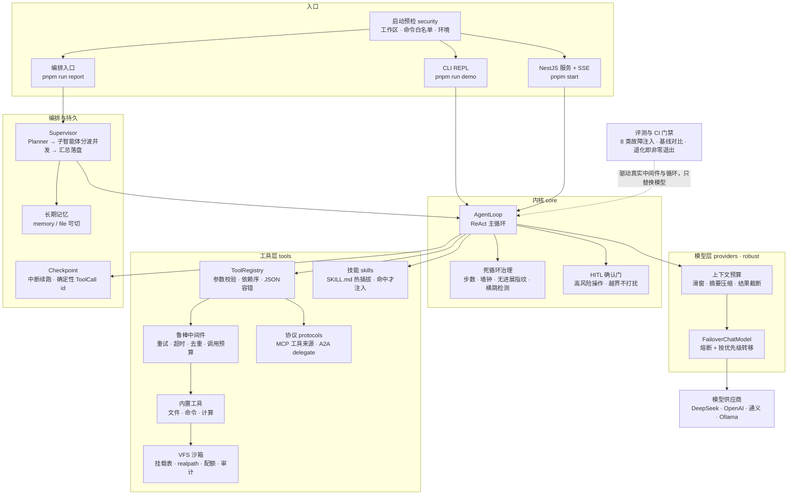

# Joy-Deep-Agent

> 通用 Agent 运行时（Harness）——对标 Codex / Claude Code 的自研主循环，NestJS 服务化 + 8 类鲁棒性治理。

## 这个仓库是什么

把三份独立 demo（协议 / 鲁棒性 / 基础 agent）整合成一个可运行、可扩展的通用 Agent 运行时。

- **目标形态**：NestJS Module/Provider 依赖注入分层（编排 / 工具 / 模型 / 持久化），统一服务与 SSE 流式接口，DeepSeek / OpenAI 零改动切换；自研 ReAct AgentLoop、Planner、Memory 与工具注册表，Skill 热插拔、VFS 沙箱、HITL 确认；接入 MCP / A2A，主 Agent 拆解后由子 Agent 并发汇总。
- **鲁棒性**：失败调用、幻觉、工具误用、死循环、上下文溢出、供应商故障、用户中断、终端环境异常，共 8 类故障的治理层。

## 架构

**三行说清**：入口有三个（CLI REPL / NestJS 服务 + SSE / 编排入口），内核只有一个（`AgentLoop`：ReAct 决策 + 死循环治理 + HITL 确认门），外面套三层——模型层管供应商与上下文预算，工具层管注册、校验、重试、沙箱与协议工具，持久层管检查点续跑与长期记忆。



读图顺序：**入口 → 内核 → 模型/工具/持久**。想知道「某个能力在哪」就直接看状态表；
想知道「为什么这么设计」，每块都有对应 ADR 与注释。

## 快速开始

```bash
pnpm install
cp .env.example .env        # 至少填一个供应商的 Key

pnpm test                   # 410 个单测，全部走假模型，不烧 API
pnpm eval                   # 跑故障注入评测，输出 docs/eval/report-<日期>.md
pnpm verify                 # 单测 + 评测门禁（CI 跑的就是这一条）
pnpm start                  # 起 Harness：http://localhost:3000
pnpm run demo               # 或直接进命令行 REPL
pnpm run report -- "调研 X 并产出一份报告"   # 多智能体编排：规划 → 并发执行 → 汇总 → 落盘
```

```bash
curl localhost:3000/agent/info
curl -N "localhost:3000/agent/stream?input=算一下%20(2%2B3)*4"
curl localhost:3000/.well-known/agent-card.json
```

## 协议接入

MCP 与 A2A 都压成**工具**（ADR-0005）：主循环对协议零感知，远端工具与内置工具在中间件、
HITL 确认、前置依赖上完全同权。适配器只依赖自定的端口（`McpConnection` / `A2AAgentClient`），
官方 SDK 只允许出现在传输实现里（ADR-0006）。

- **MCP → 工具来源**：`MCP_SERVERS` 配一个 server，它的每个 tool 变成 `mcp__<server>__<tool>` 进同一个注册表；
  远端没声明 `readOnlyHint` 的工具默认要人工确认。
- **A2A → 子 agent 传输**：`A2A_AGENTS` 配远端 agent，注册成一个 `delegate` 工具；调用前先读
  `/.well-known/agent-card.json` 发现能力，任务端点以名片声明的 `url` 为准（多 agent 时必须点名）。
- **本机也是 A2A agent**：`GET /.well-known/agent-card.json` 发名片，`POST /a2a` 收 JSON-RPC `message/send`。

配置见 `.env.example`；两个变量都留空时，工具集与行为跟没接协议时完全一致。

## 多智能体编排

`pnpm run report -- "<目标>"` 跑完整条链，产物是一份报告而不是一段对话（ADR-0007）：

1. **Planner** 调一次模型把目标拆成 `{ goal, steps[{ id, role, task, dependsOn }] }`，本地严格校验；
   计划产出不合法（截断 / 抽不出 JSON / 角色不存在 / 成环）时降级为单步，并在结果里如实标注来源与原因。
2. **子智能体**按 `dependsOn` **分波并发**（波内并发、波间串行，默认上限 3）：检索 / 分析 / 写作三类内置角色，
   各带系统提示与工具白名单。每个子智能体新建 `AgentLoop` 与独立工具注册表 —— 上下文不回流编排层，
   这是「避免单 Agent 长链路上下文溢出」的落点；上游输出按 token 预算截断后才注入下游。
3. **汇总**由主模型把各步收敛成报告，汇总调用失败则退化成确定性拼接并标注；
   落盘由代码经 `PathGuard` 执行（`report-<时间戳>.md` + `.json`），不让模型写 `<file>` 标签。

长期记忆（`MemoryStore`）在这条链上是闭环的：Supervisor 每次收尾把结果摘要 `remember` 进 scope，
Planner 下次规划时 `recall` 回来注入提示。`AGENT_MEMORY=file` 时会话与长期记忆都落到 `AGENT_MEMORY_DIR`，
换进程也能用同一 `sessionId` 把上下文接回来。缺省是 `memory`（只活在进程内，服务侧行为与从前一致）：
CLI 每个进程只跑一个任务，内存后端下长期记忆写得进、读不回，所以入口会如实提示一句——
想跨次累积就设 `AGENT_MEMORY=file`。

```bash
pnpm run report -- "对比三个候选方案，产出一份选型建议"
```

入口在不配模型 Key 时只打印可读提示并非零退出，不抛栈。

## Skill 与沙箱

**Skill 按触发条件注入**（ADR-0009）：一个技能一个目录，放一份 `SKILL.md`：

```markdown
---
name: weekly-report
description: 把零散材料整理成周报
triggers:
  - 周报                      # 关键词：大小写不敏感子串
  - /weekly\s*report/i        # 或者正则
references:
  - templates/report.md       # 相对技能目录；只注入清单，正文按需 read_file
---

正文：这个技能具体怎么做。
```

```bash
AGENT_SKILLS_DIR=examples/skills pnpm run demo    # 仓库里带了一个示例技能
```

触发条件由**代码**判定：命中才把技能注入 system prompt，没命中的一个字符都不注入（原型是把全部技能
塞进提示词再求模型自己挑，token 随技能数量线性膨胀）。改 / 加 / 删 `SKILL.md` 后下一轮就生效，不用重启；
解析不了的文件不会被静默吞掉，会连同理由一起报出来。技能也会注入到编排层的子智能体
（每步子任务各匹配一次）——子智能体不共享主循环上下文，技能得各自算。
`references` 在 `SKILL.md` 里相对**技能目录**写，注入时由代码换算成**相对工作区**的路径——
和 `read_file` 同一个坐标系，模型拿到就能直接读。

**VFS 沙箱受限写盘**（ADR-0008）：读可以看整个工作区，写只能落在可写的挂载点内——默认不收窄
（与从前一致），配了 `AGENT_WRITE_ROOT` 才收窄成「工作区只读 + 该子目录可写」。写盘还有配额
（单文件 / 累计字节 / 文件数）与审计记录（路径 / 字节 / 时间 / 挂载 / 触发它的调用 id），
配额在**落盘之前**判定，文件数按去重后的文件算（覆盖同一个文件不重复占额）。越界 / 超配额的写入
**不弹人工确认**，直接回一条可读拒绝——HITL 只花在真能改世界的事上。

```bash
AGENT_WRITE_ROOT=.joy-agent pnpm run demo    # 读全工作区，只准往 .joy-agent 写
```

两处诚实的边界：符号链接绕行用 `realpath` 挡住了（原型用字符串前缀判定，`/out-evil` 会被当成 `/out` 的子路径），
但这仍是**进程内的路径约束**，拦的是模型误操作，不是对抗恶意代码的隔离；`run_command` 走命令白名单那条路，
它的写盘不在这层管辖内。

## 当前状态

| 部分 | 位置 | 状态 |
| --- | --- | --- |
| AgentLoop（自研 ReAct 循环） | `src/core/agent-loop.ts` | **已实现**，含单测 |
| 工具注册表与 schema 校验 | `src/tools/registry.ts` | **已实现**，含单测 |
| 模型供应商抽象（DeepSeek / OpenAI / 通义千问 / Ollama 零改动切换） | `src/providers/` | **已实现**，含单测 |
| 鲁棒性中间件：失败调用 / 工具误用 / 供应商故障 / 终端异常 | `src/robust/`、`src/tools/builtin/` | **已实现**，含单测 |
| 供应商故障转移（熔断 + 按优先级自动切换，对主循环透明） | `src/providers/failover-model.ts` | **已实现**，含单测 |
| 幻觉防护（来源约束 + 交付前自我核查，默认关） | `src/robust/citation-guard.ts`、`src/robust/self-check.ts` | **已实现**，含单测 |
| 工具依赖顺序 + 启动环境预检 | `src/tools/registry.ts`、`src/security/preflight.ts` | **已实现**，含单测 |
| 评测指标口径与报告格式 | `docs/eval/`、`src/eval/` | **已实现**（口径文档 + 采集器 + 报告渲染） |
| 死循环治理（步数上限 / 无进展指纹 / 横跳检测 / 墙钟上限） | `src/core/agent-loop.ts` | **已实现**，含单测 |
| HITL 高风险操作确认 | `src/core/agent-loop.ts` | **已实现**，含单测 |
| NestJS 服务化 + SSE 流式接口 | `src/nest/`、`src/main.ts` | **已实现**，含单测 |
| 上下文溢出治理（token 估算 / 滑动窗口 / 摘要压缩） | `src/robust/context-manager.ts` | **已实现**，含单测 |
| 用户中断（Checkpoint / Resume） | `src/memory/`、`src/core/agent-loop.ts` | **已实现**，含单测（取消落盘、续跑不重复副作用、原子写） |
| Skill 按触发条件注入（`SKILL.md` 热插拔 + 预算截断） | `src/skills/` | **已实现**，含单测 |
| VFS 沙箱受限写盘（挂载表 + realpath 校验 + 配额 + 审计） | `src/vfs/` | **已实现**，含单测 |
| MCP / A2A 接入（MCP 工具来源 + A2A `delegate` + 本机 A2A 端点） | `src/protocols/`、`src/nest/a2a.controller.ts` | **已实现**，含单测 |
| Planner + 多智能体编排（规划 → 子智能体分波并发 → 汇总 → 结构化落盘） | `src/orchestrator/` | **已实现**，含单测；入口 `pnpm run report` |
| 记忆（短期会话历史 + 长期记忆，`AGENT_MEMORY=memory\|file` 可跨进程重启） | `src/memory/memory-store.ts` | **已实现**，含单测 |
| 故障注入评测（量化收益） | `src/eval/`、`docs/eval/report-*.md` | **已实现**：8 类故障 + 1 条无故障对照，入口 `pnpm eval` |
| 协议 / 鲁棒性 / 基础 agent 原型 | `prototypes/` | 已冻结，只读 |

`prototypes/` 是**只读的原始材料**（primary source）：保留现场，新实现从零写，不就地修改原型。

## 故障注入评测

`pnpm eval` 跑全部场景（8 类故障 + 1 条无故障对照），每场景每侧重复 5 次，输出
`docs/eval/report-<日期>.md` 与同名 JSON。全部用进程内确定性假供应商，不联网、不烧 key。

以未加固的裸循环为基线（同一场景、同一断言、同一模型、同样重复次数）：

| 指标 | 基线 | 加固 | 差值 |
| --- | --- | --- | --- |
| 完成率 | 11%（5/45） | 100%（45/45） | +89pp |
| 恢复成功率 | 0%（0/20） | 100%（20/20） | +100pp |
| 异常退出（未产出交付物） | 10 | 0 | — |
| token 均值（样本数） | 414（n=35） | 923（n=40） | +123% |

加固不是免费的：完成率与恢复率的提升，对应 token 均值翻了一倍多（自我核查与重试/转移的重发都算在加固账上）。
恢复时间按生产退避策略实测、不调参：S-01 限流重试 P50 = 501ms / 2 次尝试，S-06 供应商转移 P50 = 0ms / 2 次尝试。
口径见 `docs/eval/metrics.md`，逐场景数据见 `docs/eval/report-2026-09-30.md`。
评测本身用假模型（确定性回归）；另有一份**真模型 smoke 记录** `docs/eval/real-model-2026-09-30.md`——
验证换真供应商链路可用，并记下了两次真跑才暴露的两个入口级问题（都已修）。

CI 里跑 `pnpm verify`（单测 + `pnpm eval:gate`）：**加固侧不许比基线差**，总体完成率不得低于达标线
（默认 100%，依据是 2026-09-30 实测 45/45 逐类全过）；退化时非零退出并列出是哪一类退了、差多少 pp。

## 目录

```
joy-deep-agent/
├── AGENTS.md            # 给编码 agent 的工作说明
├── CONTEXT.md           # 领域词汇表（持续维护）
├── docs/adr/            # 架构决策记录（已定 9 条）
├── docs/eval/           # 评测口径与报告模板
├── examples/skills/     # 示例技能包（AGENT_SKILLS_DIR=examples/skills 即可用）
├── prototypes/          # 冻结的三份原始 demo，只读
└── src/
    ├── core/            # AgentLoop、消息类型、错误分类、异步队列
    ├── providers/       # ChatModel 抽象与 OpenAI 兼容实现、供应商配置
    ├── tools/           # 工具注册表、JSON 容错、内置工具（文件/命令/计算）
    ├── robust/          # 8 类故障的中间件实现
    ├── eval/            # 评测指标采集与报告渲染
    ├── memory/          # Checkpoint / Memory 持久化接口与实现
    ├── security/        # 路径防护
    ├── orchestrator/    # Planner、角色与子智能体、分波并发、汇总与报告落盘
    ├── skills/          # SKILL.md 解析、热插拔加载、按触发条件注入
    ├── vfs/             # 挂载表、受约束的读写、写盘配额与审计
    ├── nest/            # NestJS 模块、控制器、SSE
    ├── runtime.ts       # 模型 + 工具 + 中间件的装配（不含 Nest 依赖）
    └── cli.ts / orchestrate.ts / main.ts  # 三个入口：REPL / 编排报告 / HTTP 服务
```

## 环境

- Node.js >= 20
- pnpm >= 10
- 真实 API Key 只放本地 `.env`，**永不提交**；配置模板写成 `.env.example`

## 路线

构建节奏：grill → spec → tickets → implement。术语先落 `CONTEXT.md`，架构决策先落 `docs/adr/`。
